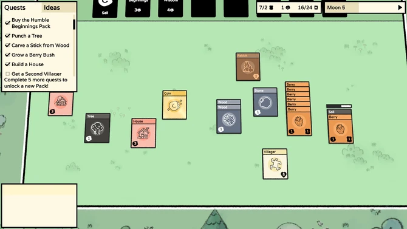
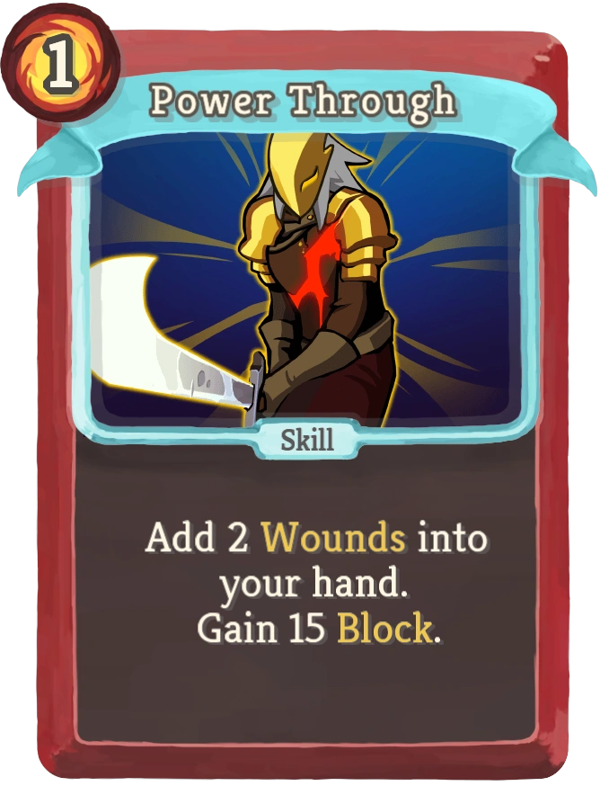
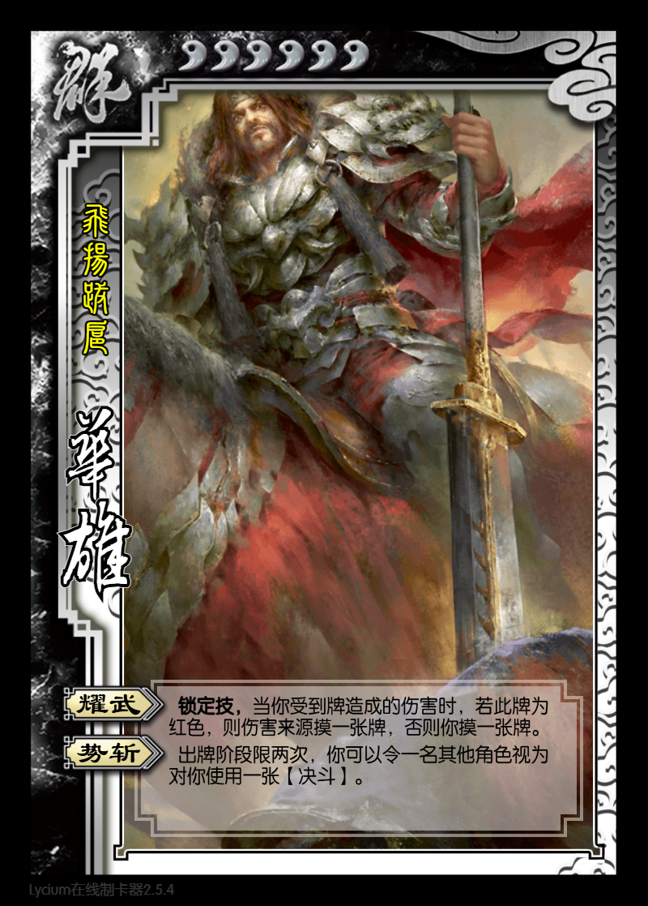
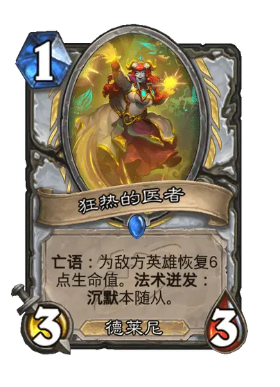
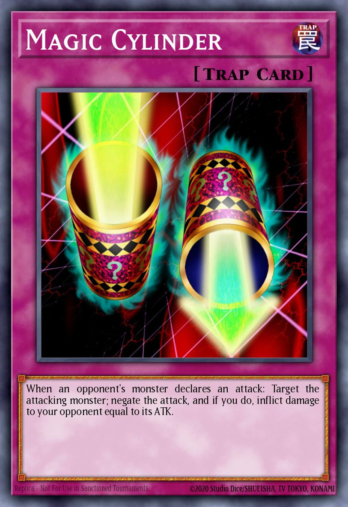
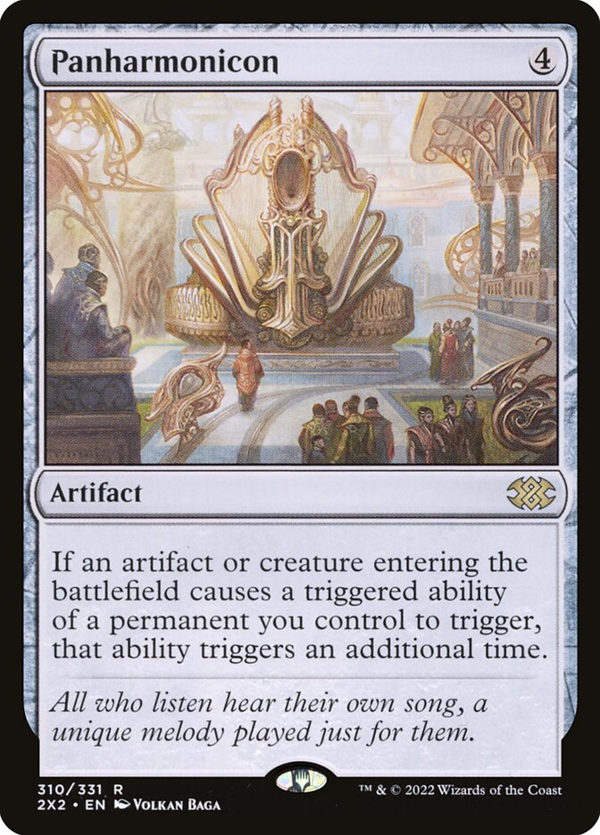
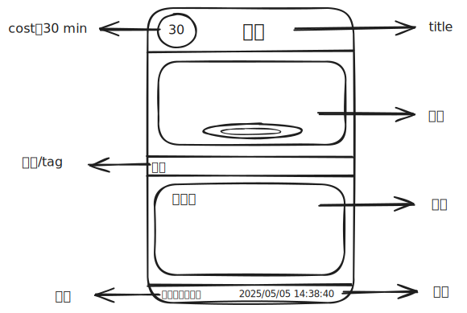
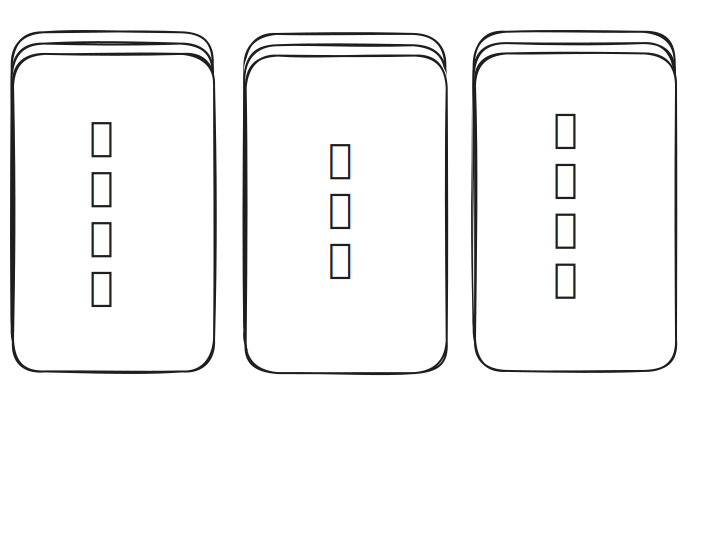

# table_mind

将自己的想法一览无余地展现在桌子上

## 桌子

布局启发自下图，一切东西都放在桌面上探讨：

  

## 卡牌

卡牌是一种很好的记录方式，它结构简洁，具有边界感，信息密度大。参考了几种卡牌设计：

| Slay the Spire | 三国杀 | Hearthstone | Yu-Gi-Oh! | Magic: The Gathering |
|:--------------:|:------:|:-----------:|:---------:|:--------------------:|
|  |  |  |  |  |

> 我的大脑很小，仅仅够放下一张桌子；我的视野很窄，仅仅能容纳一张卡牌

  

## 卡盒/背包

有些卡具有联动，应该放在一个盒子里

  

