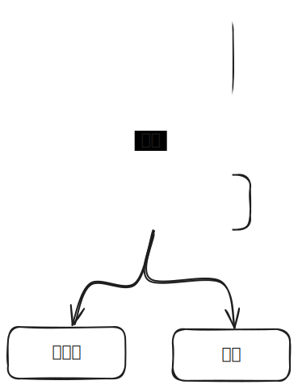

# local file repository

负责本地文件的 crud，将其限制在一个文件夹内，可以视作为 sandbox

- [Add support for Directory events](https://github.com/dart-lang/tools/issues/1681) 还不支持对文件夹的监听，决定不采用了。对于外界 crud 文件夹，用户自行 refresh

## 统一路径为 wsPath

仿照 web，将一个文件夹视为一个仓库，采用`/`作为路径分隔符

测试

```
测试 wsPath <==fromWsPath/toWsPath==> path

rootDir = if windows then 'C:\' else '/'

xxx:
  workspace: (rootDir, home, user, workspace)
  path:      (rootDir, home, user, workspace, file.txt)
  wsPath:    /file.txt

xxx:
  workspace: (rootDir, home, user, workspace)
  path:      (rootDir, home, user, workspace, folder, file.txt)
  wsPath:    /folder/file.txt

xxx:
  workspace: rootDir
  path:      (rootDir, file.txt)
  wsPath:    /file.txt

xxx:
  workspace: rootDir
  path:      (rootDir, folder, file.txt)
  wsPath:    /folder/file.txt


xxx:
  workspace: (rootDir, home, user)
  path:      (rootDir, home, user_suffix, file.txt)
  wsPath:    /home/user_suffix/file.txt
  assert error
```

> 对于AI:
> - xxx 自动替换成合适的描述，对 test 的表述
> - (rootDir, home, user) 也就是 p.join(rootDir, 'home', 'user')，表示一个路径

## action

```
action
  | change path       // 改变仓库
  | create path       // 创建文件/文件夹
  | delete path       // 删除文件/文件夹
  | rename path src   // 重命名文件/文件夹
  | move   path src   // 移动文件/文件夹
  | copy   path src   // 复制文件/文件夹
  | refresh           // 刷新仓库
```

## state

```
state
  | inital
  | loading path     // path 即是 rootDir
  | loaded snapshot // snapshot 是一个树形结构 
```

snapshot 也就是 repository 的快照，是一个树的结构，为了快速 crud，用一个 hash 表来建立 wsPath 和 item 的映射关系


```
测试 snapshot

仅仅测试

RepositoryItem() == RepositoryItem()

```

status 设计为冷流，如果需要给多个使用，那么可以添加一个适配器来分发。而注意 broadcast 是热流。



## bloc

```
bloc
  s0 = initial
  | change  = & refresh
  | create  = loaded
  | delete  = loaded
  | refresh = loading --walkDir--> loaded
```

```
setUp
  在 temp 文件夹下创建一个文件夹 RandomDir 作为仓库
    首先确认文件夹不存在，然后创建
tearDown
  删除那个仓库

验证初始状态
  status == [
    inital,
    loading path,
    loaded snapshot
  ]

添加文件/文件夹：
  清空流
  1. repo.创建文件/文件夹
  2. 验证 status

创建嵌套文件夹
  xxx

删除文件/文件夹：
  repo = xxx
  清空流
  1. repo.删除文件/文件夹
  2. 验证 status

删除含有子文件的文件夹：
  repo = xxx
  清空流
  1. repo.删除文件/文件夹
  2. 验证 status

@验证status:
  1. 容易知道一个空格empty的repo经过操作后的文件状态，比如
      predict = 
        /file.txt
        /folder/file.txt
  2. 读取文件夹的内容
      real = walkDir
  
  验证 predict == real

  检查 status 流

      比如 create应该返回的是 loaded snapshot

      然后验证 snapshot == predict
```

> 对于 AI：
> - predict 用嵌套 string map 表示
>   比如：
>   ```dart
>   predict = {
>     'file.txt': null,
>     'folder': {
>       'file.txt': null,
>      }
>   }
>   ```
> - real 也生成同样的数据结构
> - snapshot 写一个函数生成类似的结构
> 通过比较这样的数据结构来验证是否相同
>
> 对于每个 crud 逻辑测试是这样的：
> 1. 清空流
> 2. 操作
> 3. 验证 real == predict
> 4. 验证 snapshot == predict


在这个设计的过程中, 学会了

- 将测试 repo 一样封装为 bloc, 测试 state1 --op--> state2, 自己写一个 testRepo 来构建这种思维
- 学会去映射, 比如将 snapshot 映射为简单的 bullet list 来思考, 文件夹也是
- 用 dsl, 用 context 去思考

在测试的时候也发现了, 我虽然用的是冷流, 但是由于 snapshot 是共享在流信息中, 导致实际和热流差不多, 我读到的 snapshot 是最新的. 所以测试的时候, 并不是是 status == [s0, s1, s2], 而是 status == [s2, s2, s2]

由于 path 设置并不是sync, 所以它的流信息顺序不确定, 比如

path = /file.txt
refresh

由于 path 里面调用 refresh 不是 await, 所以信息的次序难说