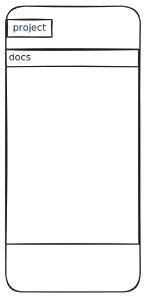
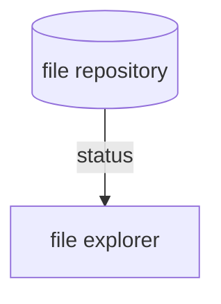

## 实现一个内置的 VSCode 查看器

time: 2025-05-12 01:21:36

Android 上面没有一个好的文件查看器，为了便于观察的App的存储的数据，因此实现一个简单的，仿照 VSCode。

- [ ] 有一个文件浏览器 explorer

### explorer

- file repository: 拥有 crud 操作，然后将整个文件信息传递给 file explorer
- file explorer: 负责文件的 isOpened，isSelected 等状态